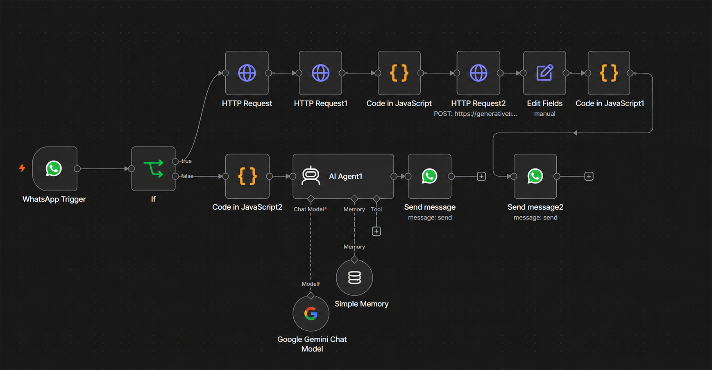

# 🤖 AI-Powered Multimodal WhatsApp Doubt Resolution Agent

> A modern, automated academic assistant that resolves student queries (text and images) directly on WhatsApp using **Google Gemini 2.5 Pro**, **Gemini Vision**, and **n8n Cloud** workflow automation.

[](https://opensource.org/licenses/MIT)
[](https://n8n.io/)
[](https://aistudio.google.com/)
[](https://developers.facebook.com/)

---

## 📸 n8n Workflow Overview

The core engine of this project is a serverless workflow built on **n8n Cloud** that handles real-time webhooks, schedules HTTP API calls, runs custom JavaScript processing, and interacts with the Google Gemini models.



---

## 📖 Project Overview

Developed during the **BHARAT UNNATI AI Fellowship** by **Learners Byte**, this project bridges the gap between students and advanced AI systems by bringing instant academic support to **WhatsApp**. 

Instead of typing complex equations or transcribing text, students can simply:
* Send text questions directly in the chat.
* Upload screenshots of worksheets, diagrams, or notes.
* Take pictures of mathematical formulas.

The backend workflow processes these inputs automatically and sends structured, mobile-friendly explanations back via WhatsApp messages.

---

## 🛠️ Architecture & Dual-Pipeline Design

The backend is split into two specialized pipelines to optimize speed, context retention, and response quality.

```mermaid
flowchart TD
    User([Student on WhatsApp]) -->|Sends Message| Webhook[WhatsApp Cloud API Webhook]
    Webhook -->|JSON Payload| Trigger[n8n WhatsApp Trigger]
    Trigger --> Route{Is Message Image?}
    
    %% Text Branch
    Route -->|No: Text Query| AI_Agent[AI Agent Node]
    AI_Agent -->|Retrieve History| Session_Memory[(Session Memory)]
    AI_Agent -->|Process query| Gemini_Pro[Google Gemini 2.5 Pro]
    Gemini Pro -->|Format Answer| WhatsApp_Send_Text[WhatsApp Reply Node]
    
    %% Image Branch
    Route -->|Yes: Image / Screenshot| Fetch_Media[Fetch Meta Graph API Image Info]
    Fetch_Media -->|Binary Get| Download_Media[Download Binary Image File]
    Download_Media -->|Custom JS| Base64_Convert[Base64 Encoding Node]
    Base64_Convert -->|JSON Payload| Gemini_Vision[Google Gemini Vision API]
    Gemini_Vision -->|Format Answer| WhatsApp_Send_Image[WhatsApp Reply Node]
    
    WhatsApp_Send_Text --> User
    WhatsApp_Send_Image --> User
```

### 1. The Text Pipeline
* **Purpose**: Handles conversational student queries.
* **Core Nodes**: AI Agent Node + Gemini Chat Model + Simple Memory Node.
* **Memory Management**: Sessions are mapped directly to the student's WhatsApp phone number. This enables multi-turn conversations and natural follow-up questions.

### 2. The Image/Multimodal Pipeline
* **Purpose**: Performs high-fidelity OCR, formula transcription, and diagram analysis.
* **Core Nodes**: HTTP Get Nodes + JavaScript Buffer Node + Gemini Vision API.
* **Key Design Choice**: The image branch bypasses the conversational AI Agent wrapper and feeds directly into Gemini Vision. This prevents conversational filler (e.g., *"Thank you for sharing this image..."*) and ensures the student immediately receives the academic answer.

---

## 💡 Engineering Challenges Solved

During the fellowship, several technical hurdles were resolved to build a robust system:
1. **Permanent Access Tokens**: Replaced Meta's default 24-hour temporary Graph API tokens with a permanent System User Token for uninterrupted webhook authentication.
2. **Buffer-to-Base64 JS Node**: Solved Gemini Vision API payload rejections by adding a custom JavaScript processor to translate WhatsApp's raw binary downloads into valid Base64 payloads.
3. **Conversational Optimization**: Implemented strict prompt constraints to limit responses to mobile-friendly formats (short paragraphs, bold text, bullet points) and avoid tables (which warp on mobile screens).

---

## 📂 Repository Structure

The workspace is organized as follows:

```text
WhatsApp-Doubt-Resolution-Agent/
├── .env.example              # Template for API credentials and tokens
├── .gitignore                # Git ignore configuration
├── LICENSE                   # MIT License details
├── n8n.png                   # Main workflow screenshot
├── workflow.json             # Reconstructed n8n workflow configuration
├── readme.md                 # Project documentation
│
├── docs/                     # Detailed architectural resources
│   ├── api.md                # Details of WhatsApp, Meta, & Gemini endpoints
│   ├── architecture.md       # Diagrammatic breakdown of text/image pipelines
│   ├── challenges.md         # Solutions to common production bugs
│   ├── memory.md             # Session handling and state configurations
│   └── setup.md              # Step-by-step Meta and n8n deployment guide
│
├── prompts/                  # Prompt templates used inside nodes
│   ├── ai-agent-system.md    # System prompt for conversational agent
│   ├── formatting.md         # WhatsApp-friendly mobile formatting rules
│   └── gemini-vision.md      # Direct visual OCR and explanation prompts
│
└── workflow/
    └── readme.md             # n8n node description and recovery notes
```

---

## 🚀 Quick Start Guide

To deploy this workflow on your own n8n instance:

1. **Configure credentials**: Copy `.env.example` to `.env` and fill in your Meta WhatsApp and Google Gemini credentials.
2. **Setup WhatsApp App**: Set up a Meta Business App and register a phone number.
3. **Import Workflow**: Import the [workflow.json](workflow.json) file directly into your n8n workspace.
4. **Deploy Webhook**: Point Meta's webhook callback to your n8n Production Webhook URL.

For detailed steps, check the [Setup and Deployment Guide](docs/setup.md).

---

## 🎓 Learning Outcomes

Building this project provided hands-on experience in:
* **Workflow Orchestration**: Mapping complex conditional routes and binary handlers in n8n.
* **Multimodal API Integration**: Combining REST, Meta Graph, and Gemini Generative endpoints.
* **Prompt Engineering**: Designing prompts for specific output structures (educational tone, mobile constraints).
* **State Management**: Managing chat history dynamically in a stateless serverless workflow.

---

## 🙏 Acknowledgements

We thank the mentors and team at the **BHARAT UNNATI AI Fellowship** and **Learners Byte** for providing the structured guidance, tools, and support necessary to bring this project to fruition.
